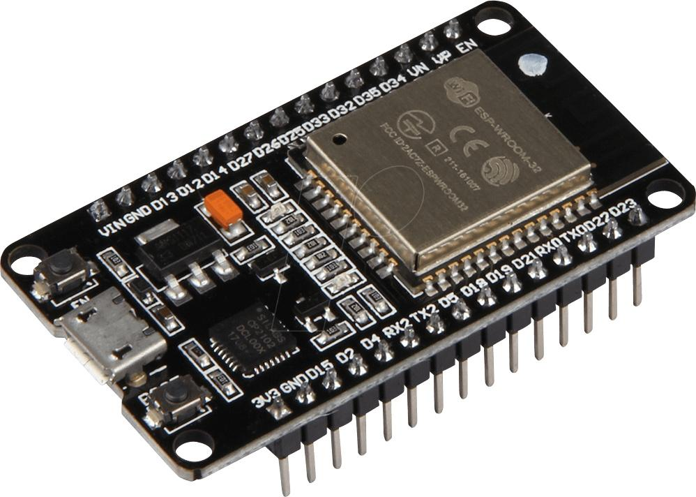
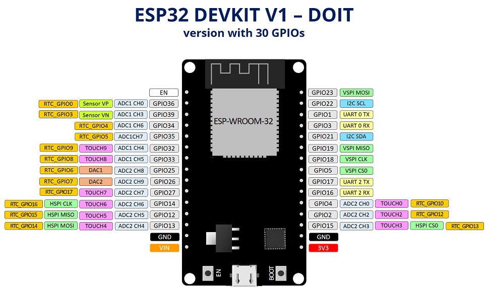

## 1. 简介
ESP32是一个由 Espressif 提供的热门的WiFi/蓝牙单片机的片上系统（SoC），大部分I/O引脚由两侧排针引出以便于连接。开发者可以根据需要（as needed）将这些引脚连接到外围设备。当使用面包板时，标准化的排针也令开发变得容易且方便。

详见：[ESP32 快速参考](https://docs.singtown.com/micropython/zh/latest/esp32/esp32/quickref.html)。

## 2. 功能说明
在实现各种功能之前，必须先了解自己所使用的开发板的功能，不同类型的板子引脚定义可能不同，不清楚的情况下接入外围设备，很容易烧毁板子或接入的外围模块。下图为esp32s的引脚图：

- EN: POWERON_RESET 重置按钮：按下此按钮可以重置系统
- Boot: 下载按钮：按住Boot按钮并按下EN按钮初始化固件下载模式。然后用户可以通过串口下载固件。
- USB: USB接口。是给板子供电以及ESP-WROOM-32与PC通信的接口。
- I/O: ESP-WROOM-32 的大部分I/O引脚已由板上的两侧排针引出。用户可以对ESP32进行编程来实现各种功能，比如PWM,ADC,DAC,I2C,I2S,SPI 等。

### 2.1 引脚说明
eps32 引脚使用可以参考上图，但需要注意以下几点：
 - Pins 1 and 3 are REPL UART TX and RX respectively
 - Pins 6, 7, 8, 11, 16, and 17 are used for connecting the embedded flash, and are not recommended for other uses
 - Pins 34-39 are input only, and also do not have internal pull-up resistors
 - The pull value of some pins can be set to Pin.PULL_HOLD to reduce power consumption during deepsleep.