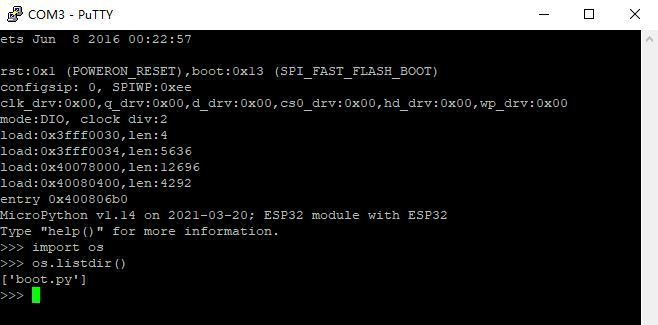
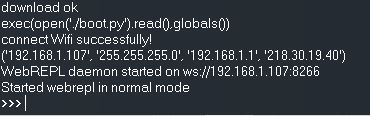

## 1. MicroPython 介绍

MicroPython是 Python 3 语言 的精简高效实现 ，包括Python标准库的一小部分，经过优化可在微控制器和受限环境中运行。

MicroPython包含了诸如交互式提示（REPL），任意精度整数，关闭，列表解析，生成器，异常处理等高级功能。 足够精简，适合运行在只有256k的代码空间和16k的RAM的芯片上。

MicroPython旨在尽可能与普通Python兼容，让您轻松将代码从桌面传输到微控制器或嵌入式系统。

## 2. 环境搭建
本章介绍 MircoPython 的环境搭建。

### 2.1 准备工作

| 条目 | 说明 |
| ---- | ---- |
| 板子 | 这里使用的乐鑫科技的 ESP32S(ESP32-WROOM-32) |
| OS | Win10 |
| Python | 3.7.6 |
| 固件 | [MicroPython 固件](http://www.micropython.org/download/)，需要选择 Espressif 的 ESP32 模块对应的通用固件 |
| 串口工具 | Putty 或 Xshell |


### 2.2 esptool 安装

esptool 是官方提供的工具，通过 pip 安装，使用以下命令：
```
$ pip install esptool==2.0
```
说明：最新版本没有安装成功，2.0 版本安装成功并测试通过。

### 2.2 安装固件

在安装新版 MicroPython 固件前，先将设备的 FlashROM 完全清除。使用以下命令：
```
$ esptool.py --chip esp32 --port COM3 erase_flash
```
参数说明：
- chip：芯片类型，使用 esp32
- port：这里使用串口连接，`我的电脑`->`管理`->`设备管理器`->`端口` 中查看。
- 也可以通过 `esptool.py -h` 查看帮助。

等待擦除完成。

执行以下命令上传 MircoPython 固件：
```
$ esptool.py --chip esp32 --port COM3 write_flash -z 0x1000 firmware.bin
```
参数说明：
- z: 开始地址
- firmware.bin：固件路径，这里使用的版本是：esp32-idf4-20210202-v1.14.bin

看到以下信息，说明成功：
```
esptool.py v2.0
Connecting........___
Chip is ESP32D0WDQ6 (revision (unknown 0xa))
Uploading stub...
Running stub...
Stub running...
Configuring flash size...
Auto-detected Flash size: 4MB
Compressed 1446224 bytes to 941239...
Wrote 1446224 bytes (941239 compressed) at 0x00001000 in 83.2 seconds (effective 139.0 kbit/s)...
Hash of data verified.

Leaving...
Hard resetting...
```

### 2.3 交互式命令行（串口）

在 MicroPython 固件烧录成功之后，可以使用 Putty 通过串口连接到板子上。可以通过 `REPL`(Read Eval Print Loop) 交互式解释器执行代码，如下：



### 2.4 IDE

好的 IDE 可以提高开发效率，选一款自己喜欢的即可，这里介绍几款。
- PyCharm + MicroPython 插件
- [uPyCraft](https://randomnerdtutorials.com/uPyCraftWindows)
- VSCode + MicroPython 插件
- [EMP-IDE](https://github.com/Singein/EMP-IDE):
- WebREPL:官方提供的，比较简陋些。
- [Mu](https://codewith.mu/en/download)

### 2.5 WebREPL

WebREPL即通过浏览器进行交互式编程，按照以下步骤开启。
- 首先，下载并执行 boot.py （详见附件代码文件）。
  ```
  import webrepl
  # 需要先连接到 wifi，才能启动成功。
  webrepl.start()
  ```
  启动成功，如下图所示：

  
- 下载客户端工具，[点击下载此仓库](https://github.com/micropython/webrepl)。
- 解压，执行`webrepl.html`，输入地址。


## 3. FAQ

### 3.1 ESP32正常启动，但为何 uPyCraft 无法连接，弹出烧录固件的窗口

原因：板子启动时自动执行了某程序，且耗时较长，如：wifi自动连接。

方法：putty 连接，执行以下代码：
```bash
> import uos
> uos.remove('main.py')
```
如果，boot.py 中还有代码，也看下是否需要清理，方法同上。然后便可以连接上了，建议调试完成后，在实现自启动。


