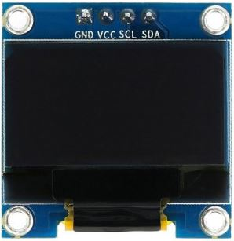

> 本章介绍如何使用 ESP32 驱动 OLED 屏幕显示文字。

## 1. 准备工作

我们需要的材料如下：
- ESP32 开发板，这里同样使用之前的 ESP32S（30引脚）
- 0.9 寸 oled 小屏幕，四个引脚使用 I2C
- Micropython 固件

<div align="center">
    
</div>

## 2. 电路连接

ESP32 输入电源使用 USB 供电或者 5V 电池，开发板和 OLED 的引脚连接如下：

| EPS32 | OLED |
| ---- | ---- |
| `3.3v VCC` | `VCC` |
| `GND` | `GND` |
| `G21` | `SCL` |
| `G22` | `SDA` |

## 3. 代码实现

OLED 屏幕需要使用 ssd1306 驱动（代码详见./src/ssd1306.py）。这里我们在屏幕上显示 `hello esp32`，示例代码如下：

```python
from machine import Pin, I2C
from ssd1306 import SSD1306_I2C

i2c = I2C(scl=Pin(21), sda=Pin(22))
screen = SSD1306_I2C(128, 64, i2c)


def show(message):
    screen.fill(0)
    screen.text('hello esp32!', 0, 0)
    screen.show()
```

更多功能，可以查阅相关资料。


