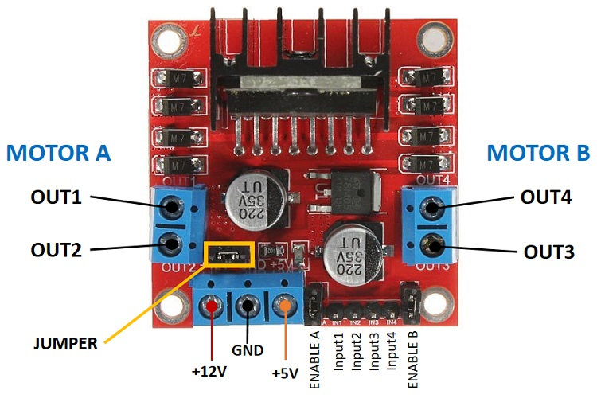
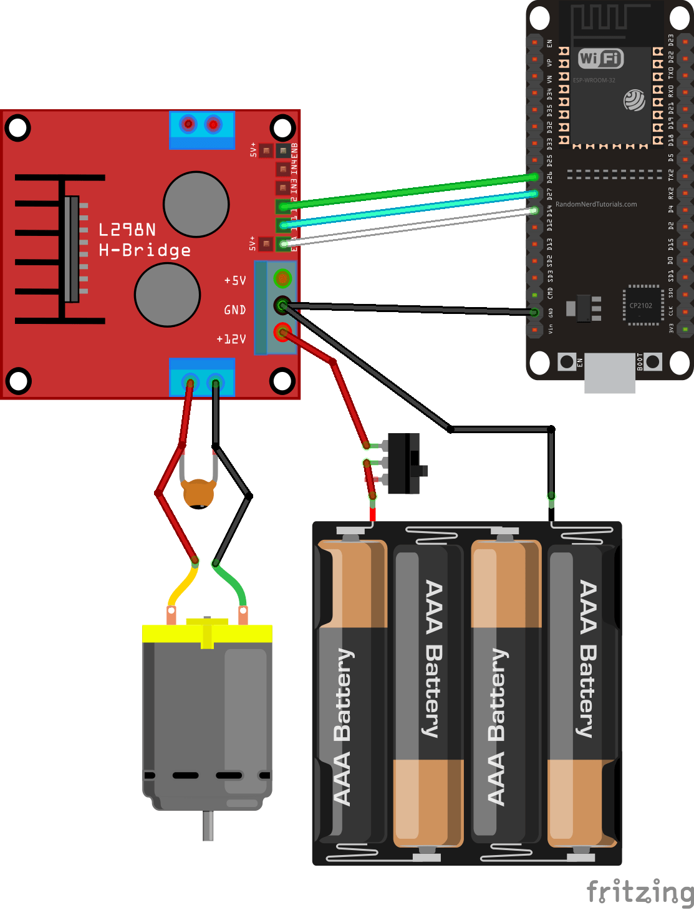
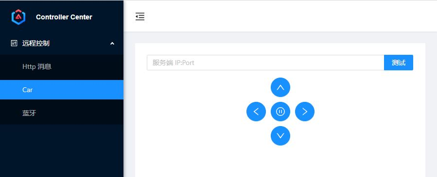

> 本章介绍如何实现使用 EPS32 作为控制板的 Wifi 小车。

## 1. 准备工作

我们需要以下材料：

- ESP32 开发板
- L298N 电机驱动
- 两个 3v 的直流减速电机
- 7v 以上的电池

### 1.1 整体思路

ESP32 上实现 httpserver，手机通过 web 接入，发送控制指令，ESP32收到后驱动 L298N，实现小车的 Wifi 控制。

### 1.2 L298N 介绍

看一下L298N电机驱动器的引脚排列，如下图：

    

电机驱动端子：  
| 端子 | 说明 |
| ---- | ---- |
| ` OUT1` | 直流电机A正极 |
| ` OUT2` | 直流电机A负极|
| ` OUT3` | 直流电机B正极 |
| ` OUT4` | 直流电机B负极 |

电源相关端子：
| 端子 | 说明 |
| ---- | ---- |
| `+12V` | 输入电源 |
| `GND` | 地 |
| `+5V` | 逻辑电路电源。移除跳线，则需要5V输入。有跳线，则充当5V输出 |

>注意：+12V，可输入6~12v 的电源，如果超过12v，不建议使用跳线，提供5v输出。

引脚说明：
| 引脚 | 说明 |
| ---- | ---- |
| `IN1` | 电机A的输入1 |
| `IN2` | 电机A的输入2 |
| `IN3` | 电机B的输入1 |
| `IN4` | 电机B的输入2 |
| `EN1` | 电机A的使能引脚 |
| `EN2` | 电机B的使能引脚 |

## 2. 电路连接

整体电路连接如下图：

    

引脚连接如下表：
| ESP32 | L298N |
| ---- | ---- |
| `G26` | `in1` |
| `G25` | `in2` |
| `G33` | `in3` |
| `G32` | `in4` |

这些ESP32的引脚可以适当地调整。

## 3. 代码实现

- 驱动端代买见 motor.py + httpserver。
- Web 操作端代码见：[control-center](https://gitee.com/liangw/controll-center)。

    

